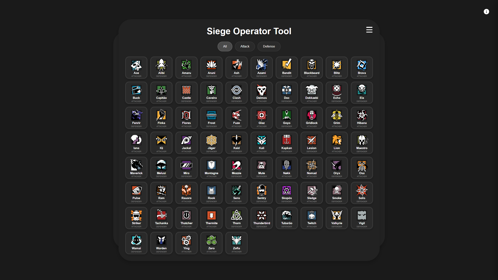

# SiegeGrid v2.2

A modern, responsive Rainbow Six Siege operator grid and randomizer tool built with vanilla JavaScript, HTML, and CSS.



## Features

### 🎯 **Operator Grid**
- Clean, responsive grid layout displaying all R6S operators
- Operator icons, names, and roles clearly displayed
- Smooth animations and hover effects

### 🔍 **Role Filtering**
- Filter operators by role: All, Attack, or Defense
- Smooth transition animations between filters
- Maintains grid layout consistency

### 📱 **Operator Details**
- Click any operator to view detailed information
- Comprehensive modal with:
  - Bio information (real name, birthplace)
  - Physical stats (height, weight, country)
  - Game ratings (health, speed, difficulty)
  - Season and pricing information

### 🎲 **Side Panels**
- **Ownership Panel**: Track which operators you own
- **Randomizer Panel**: Generate random operator selections
- Collapsible design with smooth animations

### ℹ️ **Info Panel**
- Slide-out panel with version info and links
- Developer information and project links
- Clean, minimal design

### ♿ **Accessibility**
- Full keyboard navigation support
- ARIA labels and semantic HTML
- Focus management and screen reader friendly
- High contrast design

### 📱 **Responsive Design**
- Works seamlessly on desktop and mobile devices
- Adaptive grid layout
- Touch-friendly interface

## Tech Stack

- **HTML5** - Semantic markup with accessibility features
- **CSS3** - Modern styling with CSS Grid, Flexbox, and custom properties
- **Vanilla JavaScript** - No frameworks, pure ES6+
- **JSON** - Operator data storage

## Getting Started

### Prerequisites
- A modern web browser
- Local web server (for loading JSON data)

### Installation

[This app is hosted on Vercel](https://siegegrid.vercel.app)

- or -

1. Clone the repository:
```bash
git clone https://github.com/mbtaco/siegegrid.git
cd siegegrid
```

2. Serve the files using a local web server:
```bash
# Using Python 3
python -m http.server 8000

# Using Node.js
npx http-server

# Using PHP
php -S localhost:8000
```

3. Open your browser and navigate to `http://localhost:8000`

## Usage

### Basic Navigation
- **Filter operators**: Use the role buttons (All, Attack, Defense) to filter the grid
- **View details**: Click any operator to see detailed information
- **Toggle panels**: Use the hamburger menu to show/hide side panels
- **Info panel**: Click the info button (ⓘ) in the top-right corner

### Keyboard Navigation
- **Tab/Shift+Tab**: Navigate between interactive elements
- **Enter/Space**: Activate buttons and open operator details
- **Escape**: Close modals and panels

## Browser Support

- Chrome 60+
- Firefox 55+
- Safari 12+
- Edge 79+

## Contributing

Contributions are welcome! Please feel free to submit issues, feature requests, or pull requests.

### Development Guidelines
- Maintain accessibility standards
- Keep the codebase vanilla (no frameworks)
- Follow existing code style and conventions
- Test on multiple devices and browsers

## License

This project is open source and available under the [MIT License](LICENSE).

## Acknowledgments

- **Rainbow Six Siege** - Ubisoft Entertainment
- **Operator Icons** - Ubisoft assets
- **Development** - Built with assistance from Claude 4 Sonnet

## Contact

- **Developer**: taco
- **GitHub**: [@mbtaco](https://github.com/mbtaco)
- **Discord**: taco_4
- **Project Repository**: [github.com/mbtaco/siegegrid](https://github.com/mbtaco/siegegrid)

---

*SiegeGrid is not affiliated with or endorsed by Ubisoft Entertainment. Rainbow Six Siege is a trademark of Ubisoft.*
